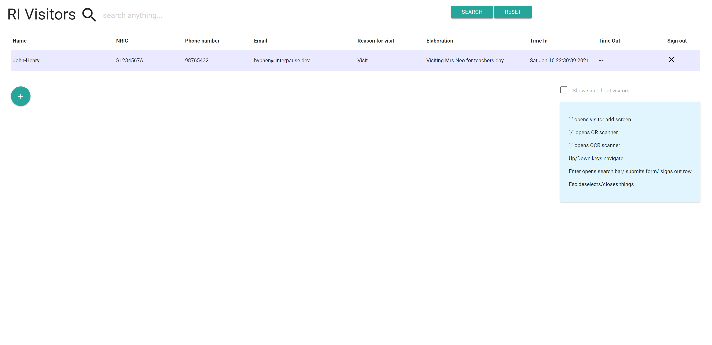
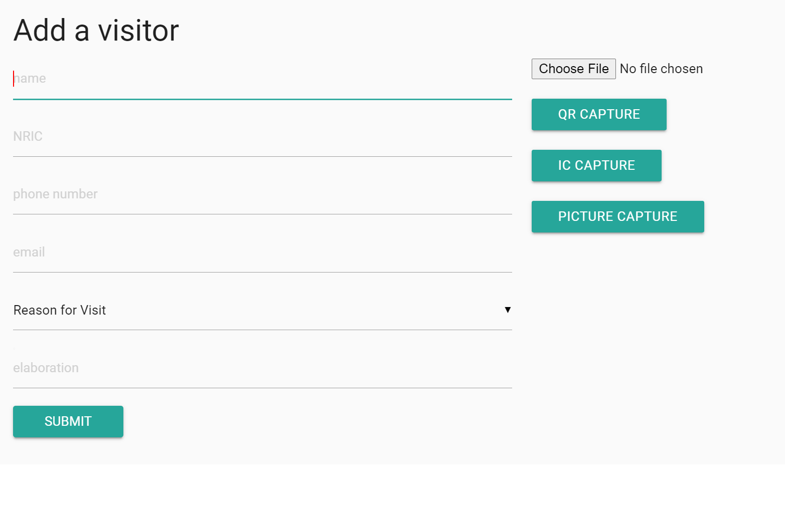
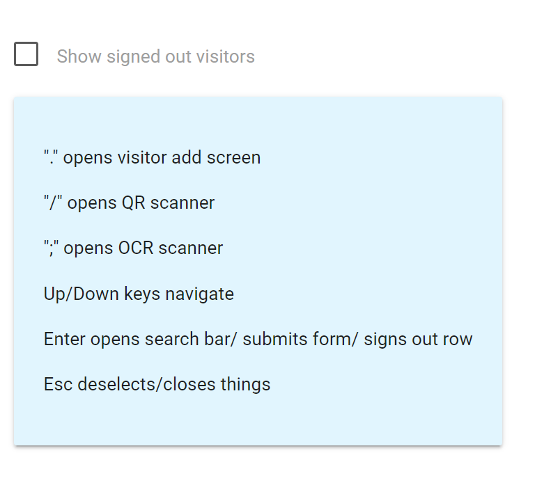

# RAGS

John-Henry, Charles and Matthew worked together to make this as the final exam/project of Computer Elective Programme. It was also meant to replace the school's previous guardhouse system but was denied in security vetting due to the IC scanning feature being deemed a privacy intrusion back then.

## Installation

To run the guardhouse interface:

```bash
// python3 is required
pip install -r requirements.txt
python app.py
```

As for the Pre-visit Registration, it works even without a server so you can just open `index.html` with a browser.

## Features

Before visiting Raffles, the visitor can go to the Pre-visit Registration site, where they can key in their details in order to generate a QR code. This QR code is later scanned at the guardhouse to register in much quicker.

Other than scanning QR codes, the guardhouse interface can scan IC cards for a person's NRIC and name. The picture of the IC is also stored for easy reference by hovering over the user details in the table.

The interface is designed to be easy to read and use with convinient keybinds to easy open menus and a search bar to filter through visitors.

## Screenshots




